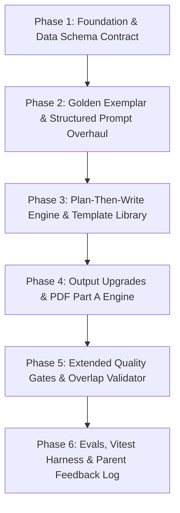

# AI Textbook-to-Reviewer: Technical Gap Analysis & System Audit

**Project:** AI Textbook-to-Reviewer (Quiz Generator Upgrade)  
**Date:** August 18, 2026  
**Auditor:** Senior Full-Stack Engineer & QA Auditor  
**Scope:** Architectural & Codebase Audit (T1–T8 Upgrade Target State)  
**Status:** Audit Complete — No Application Code Modified  

---

## Executive Summary & System Overview

This audit evaluates the codebase located at `ai-textbook-reviewer-mvp` against the **Target State (T1–T8 Upgrade Specification)**.

> [!NOTE]
> **Framework Clarification:**  
> The codebase is built on **Next.js 16 (App Router)** + **React 19** + **TypeScript** + **Drizzle ORM** + **PostgreSQL** + **PDFKit** + **Vitest** (the audit request description mentions SvelteKit 5, which is a documentation/prompt context typo; all audit findings are based on the actual Next.js codebase).

### Current AI Architecture Stack
* **OCR Vision Engine:** `meta/llama-3.2-11b-vision-instruct` (configured in `.env`) / fallback `nvidia/llama-3.1-nemotron-nano-vl-8b-v1` in [`nvidia-client.ts`](file:///Users/collabera.digital/Documents/VIBE_CODED/glm52-ai-textbook-reviewer-mvp/ai-textbook-reviewer-mvp%20%281%29/src/lib/server/ai/nvidia-client.ts#L56).
* **Reasoning & Generation Model:** `nvidia/nemotron-3-super-120b-a12b` via NVIDIA OpenAI-compatible Chat Completions API.
* **Database ORM:** Drizzle ORM PostgreSQL (`src/db/schema.ts`).
* **Document Export:** PDFKit (`src/lib/server/pdf/generate-pdf.ts`).

---

## Section A: Full Gap Table (T1–T8 Target State)

| Item | Target Feature | Status | Evidence (File & Line Range) | Gap Summary | Effort | Risk |
| :--- | :--- | :---: | :--- | :--- | :---: | :---: |
| **T1** | **Structured OCR Extraction** | ❌ Missing | [`nvidia-ocr.ts:L77`](file:///Users/collabera.digital/Documents/VIBE_CODED/glm52-ai-textbook-reviewer-mvp/ai-textbook-reviewer-mvp%20%281%29/src/lib/server/ai/nvidia-ocr.ts#L77) [`nvidia-ocr.ts:L24-45`](file:///Users/collabera.digital/Documents/VIBE_CODED/glm52-ai-textbook-reviewer-mvp/ai-textbook-reviewer-mvp%20%281%29/src/lib/server/ai/nvidia-ocr.ts#L24-L45) | Prompt is a generic single sentence ("Transcribe all readable text..."). Missing prompts/rules for verbatim blank tokens (`_ _`), item numbers, parenthesized word banks, picture cues, and anti-solving instruction. | **S** | **Low** |
| **T2** | **Exercise-Aware Normalizer** | 🟡 Partial | [`normalize-ocr.ts:L158-226`](file:///Users/collabera.digital/Documents/VIBE_CODED/glm52-ai-textbook-reviewer-mvp/ai-textbook-reviewer-mvp%20%281%29/src/lib/server/ocr/normalize-ocr.ts#L158-L226) [`grounding.ts:L24-47`](file:///Users/collabera.digital/Documents/VIBE_CODED/glm52-ai-textbook-reviewer-mvp/ai-textbook-reviewer-mvp%20%281%29/src/lib/server/validation/grounding.ts#L24-L47) | Normalizes Unicode characters/dashes, but lacks regex parsing for parenthesized word banks (e.g. `(bl-, cl-)`), `blankToken`, `itemNumber`, `pictureCue`. Does not produce `ExerciseItem` vs `DeclarativeFact` fact kinds. | **M** | **Med** |
| **T3** | **Verification + Snapshot Upgrade** | 🟡 Partial | [`schema.ts:L139-152`](file:///Users/collabera.digital/Documents/VIBE_CODED/glm52-ai-textbook-reviewer-mvp/ai-textbook-reviewer-mvp%20%281%29/src/db/schema.ts#L139-L152) [`OcrVerification.tsx:L140-169`](file:///Users/collabera.digital/Documents/VIBE_CODED/glm52-ai-textbook-reviewer-mvp/ai-textbook-reviewer-mvp%20%281%29/src/components/OcrVerification.tsx#L140-L169) [`verify/route.ts:L51-59`](file:///Users/collabera.digital/Documents/VIBE_CODED/glm52-ai-textbook-reviewer-mvp/ai-textbook-reviewer-mvp%20%281%29/src/app/api/exam-prep/%5Bid%5D/verify/route.ts#L51-L59) | `verifiedContents` DB schema stores a plain text string `content`. Verification UI renders a single unstructured `<textarea>`. Lacks itemized review, `pictureCue`, proposed answer/missing letter confirmable chips, and structured snapshot fields. | **M** | **Med** |
| **T4** | **Template-Based Generation** | ❌ Missing | [`prompts.ts:L10-40`](file:///Users/collabera.digital/Documents/VIBE_CODED/glm52-ai-textbook-reviewer-mvp/ai-textbook-reviewer-mvp%20%281%29/src/lib/server/generation/prompts.ts#L10-L40) [`generate-reviewer.ts:L209-226`](file:///Users/collabera.digital/Documents/VIBE_CODED/glm52-ai-textbook-reviewer-mvp/ai-textbook-reviewer-mvp%20%281%29/src/lib/server/generation/generate-reviewer.ts#L209-L226) | Prompts use generic question types (`multiple_choice`, `fill_blank`, `true_false`, `identification`). Missing templates (`blend_mc`, `tf_swap`, `reverse_id`), hard wordBank/swap rules, 2-phase Plan-Then-Write, and `docs/GOLDEN_EXEMPLAR.md` integration. | **L** | **High** |
| **T5** | **Extended Validation Gates** | 🟡 Partial | [`grounding.ts:L96-170`](file:///Users/collabera.digital/Documents/VIBE_CODED/glm52-ai-textbook-reviewer-mvp/ai-textbook-reviewer-mvp%20%281%29/src/lib/server/validation/grounding.ts#L96-L170) [`duplicates.ts:L21-55`](file:///Users/collabera.digital/Documents/VIBE_CODED/glm52-ai-textbook-reviewer-mvp/ai-textbook-reviewer-mvp%20%281%29/src/lib/server/validation/duplicates.ts#L21-L55) | Grounding checks basic keyword matching. Lacks blank/word-bank consistency checks, choice-set `wordBank` containment checks, distinct page/item coverage verification, and version overlap check (<50% overlap rule). | **M** | **Med** |
| **T6** | **Output Upgrades (PDF & Part A)** | 🟡 Partial | [`generate-pdf.ts:L86-178`](file:///Users/collabera.digital/Documents/VIBE_CODED/glm52-ai-textbook-reviewer-mvp/ai-textbook-reviewer-mvp%20%281%29/src/lib/server/pdf/generate-pdf.ts#L86-L178) | Generates basic child worksheet & answer key PDFs. Missing LLM-free deterministic "Part A — Study Reviewer" (words grouped by blend + sentences to remember). Answer Key PDF does not print page references. | **M** | **Low** |
| **T7** | **Evals & Feedback Loop** | ❌ Missing | [`pipeline.test.ts:L1-227`](file:///Users/collabera.digital/Documents/VIBE_CODED/glm52-ai-textbook-reviewer-mvp/ai-textbook-reviewer-mvp%20%281%29/src/lib/pipeline.test.ts#L1-L227) [`schema.ts:L1-251`](file:///Users/collabera.digital/Documents/VIBE_CODED/glm52-ai-textbook-reviewer-mvp/ai-textbook-reviewer-mvp%20%281%29/src/db/schema.ts#L1-L251) | Vitest has basic unit tests for OCR and grounding helpers. No frozen golden eval dataset or scoring suite (grounding %, word-bank validity, type balance). No DB table/API for logging parent question edits or deletions. | **M** | **Low** |
| **T8** | **Consistency Checks** | 🟡 Partial | [`.env:L8-12`](file:///Users/collabera.digital/Documents/VIBE_CODED/glm52-ai-textbook-reviewer-mvp/ai-textbook-reviewer-mvp%20%281%29/.env#L8-L12) [`.env.example:L8-9`](file:///Users/collabera.digital/Documents/VIBE_CODED/glm52-ai-textbook-reviewer-mvp/ai-textbook-reviewer-mvp%20%281%29/.env.example#L8-L9) [`nvidia-client.ts:L56`](file:///Users/collabera.digital/Documents/VIBE_CODED/glm52-ai-textbook-reviewer-mvp/ai-textbook-reviewer-mvp%20%281%29/src/lib/server/ai/nvidia-client.ts#L56) [`ARCHITECTURE.md:L47`](file:///Users/collabera.digital/Documents/VIBE_CODED/glm52-ai-textbook-reviewer-mvp/ai-textbook-reviewer-mvp%20%281%29/ARCHITECTURE.md#L47) | Model environment configuration is inconsistent between documentation, `.env.example`, `.env`, and fallback code. `enable_thinking: false` is configured in `nvidia-client.ts`, but vision OCR response schema is unstructured. | **S** | **Low** |

---

## Deep-Dive Analysis per Audit Target (T1–T8)

### T1. Structured OCR Extraction
* **Current State:** [`src/lib/server/ai/nvidia-ocr.ts`](file:///Users/collabera.digital/Documents/VIBE_CODED/glm52-ai-textbook-reviewer-mvp/ai-textbook-reviewer-mvp%20%281%29/src/lib/server/ai/nvidia-ocr.ts#L77) issues a single generic instruction: `"Transcribe all readable text from this page accurately."`
* **Gaps:**
  1. Does not instruct the vision model to capture exact blank tokens (`_ _` or `___`).
  2. Does not instruct the model to explicitly preserve parenthesized word banks (e.g. `(bl-, cl-, fl-, gl-, pl-, sl-)`).
  3. Does not extract visual cues (`pictureCue`, e.g., `"clipart of a clock"`).
  4. Lacks a critical prompt directive prohibiting the OCR model from completing/solving fill-in-the-blank or matching exercises during visual transcription.
* **Impact:** OCR output loses structured exercise context, leading to downstream ambiguity when building Grade 1 fill-in-the-blank or blend multiple choice items.

---

### T2. Exercise-Aware Normalizer
* **Current State:** [`src/lib/server/ocr/normalize-ocr.ts`](file:///Users/collabera.digital/Documents/VIBE_CODED/glm52-ai-textbook-reviewer-mvp/ai-textbook-reviewer-mvp%20%281%29/src/lib/server/ocr/normalize-ocr.ts) cleans line breaks, zero-width characters, and quotes, outputting a flat array of `OcrBlock`s and a combined `text` string.
* **Gaps:**
  1. Missing regex extraction for parenthesized word banks (e.g. `/^$$\s*([a-z]{1,4}-(?:\s*,\s*[a-z]{1,4}-)*)\s*$$/i`).
  2. Missing blank token detector (e.g., `_ _`, `___`, `[ ]`).
  3. Missing categorization into `ExerciseItem` (item number, prompt with blank, word bank, picture cue) vs `DeclarativeFact` (general reading sentences).
  4. Current grounding extractor ([`grounding.ts:L24`](file:///Users/collabera.digital/Documents/VIBE_CODED/glm52-ai-textbook-reviewer-mvp/ai-textbook-reviewer-mvp%20%281%29/src/lib/server/validation/grounding.ts#L24)) simply splits page text by periods/newlines into generic string fragments (`F1`, `F2`, etc.).

---

### T3. Verification UI & Verified Snapshot Upgrade
* **Current State:**
  * DB Table [`verified_contents`](file:///Users/collabera.digital/Documents/VIBE_CODED/glm52-ai-textbook-reviewer-mvp/ai-textbook-reviewer-mvp%20%281%29/src/db/schema.ts#L139-L152) has schema: `id`, `snapshotId`, `pageId`, `content: text`, `sourceOrder`, `included: boolean`.
  * Verification UI ([`OcrVerification.tsx`](file:///Users/collabera.digital/Documents/VIBE_CODED/glm52-ai-textbook-reviewer-mvp/ai-textbook-reviewer-mvp%20%281%29/src/components/OcrVerification.tsx#L155)) provides a single `<textarea>` per page.
* **Gaps:**
  1. `verified_contents` schema lacks structured fields (`itemNumber`, `sentence`, `blankToken`, `wordBank`, `pictureCue`, `proposedAnswer`, `parentConfirmed`).
  2. Verification UI does not support item-by-item verification, picture cue displays, or proposed answer / missing letter confirmable chips.
  3. Parents can only accept or reject whole page text blocks rather than individual exercise items.

---

### T4. Template-Based Generation & Plan-Then-Write Pipeline
* **Current State:**
  * [`src/lib/server/generation/prompts.ts`](file:///Users/collabera.digital/Documents/VIBE_CODED/glm52-ai-textbook-reviewer-mvp/ai-textbook-reviewer-mvp%20%281%29/src/lib/server/generation/prompts.ts) requests basic question types (`multiple_choice`, `fill_blank`, `true_false`, `identification`).
  * `generateReviewer` executes a single reasoning call directly to output questions.
* **Gaps:**
  1. Missing specified question template taxonomy: `blend_mc`, `fill_blank`, `tf_exact`, `tf_swap`, `reverse_id`.
  2. Missing hard rule enforcing MC choices $\subseteq$ `wordBank` (exactly 3 choices for Grade 1).
  3. Missing hard rule for `tf_swap` restricting false statements to swapping words from elsewhere in the snapshot.
  4. Lacks 2-phase "Plan-Then-Write" architecture:
     * *Phase 1:* Generate & validate `factId → questionType` plan for coverage and type balance.
     * *Phase 2:* Generate question JSON strictly adhering to the approved plan.
  5. Deterministic difficulty rules (Easy / Normal / Challenge) are not defined or enforced.
  6. `docs/GOLDEN_EXEMPLAR.md` does not exist in the repository and is not embedded into reasoning prompts.

---

### T5. Extended Validation Gates
* **Current State:** [`src/lib/server/validation/grounding.ts`](file:///Users/collabera.digital/Documents/VIBE_CODED/glm52-ai-textbook-reviewer-mvp/ai-textbook-reviewer-mvp%20%281%29/src/lib/server/validation/grounding.ts) checks whether answer tokens appear in cited fact text.
* **Gaps:**
  1. No check verifying completed words belong to extracted `wordBank`.
  2. No validation that multiple-choice choices are subsets of `wordBank` with zero duplicate options.
  3. No coverage check ensuring questions are balanced across distinct source pages and items.
  4. No version-overlap check when generating new reviewer versions to guarantee <50% question overlap with prior versions of the same exam prep.

---

### T6. Output Upgrades (PDF & Part A Reviewer)
* **Current State:** [`src/lib/server/pdf/generate-pdf.ts`](file:///Users/collabera.digital/Documents/VIBE_CODED/glm52-ai-textbook-reviewer-mvp/ai-textbook-reviewer-mvp%20%281%29/src/lib/server/pdf/generate-pdf.ts) renders standard practice worksheets and answer keys.
* **Gaps:**
  1. Missing "Part A — Study Reviewer" section (a deterministic, LLM-free section at the beginning of the PDF containing target words grouped by blend, plus key sentences to remember).
  2. Answer Key PDF (`generateAnswerKeyPdf`) does not print page citations (e.g., `[Page 42]`) alongside correct answers.

---

### T7. Evals & Feedback Loop
* **Current State:** Unit tests in [`src/lib/pipeline.test.ts`](file:///Users/collabera.digital/Documents/VIBE_CODED/glm52-ai-textbook-reviewer-mvp/ai-textbook-reviewer-mvp%20%281%29/src/lib/pipeline.test.ts) test basic normalizer and grounding edge cases.
* **Gaps:**
  1. No frozen golden eval dataset snapshot (Grade 1 spelling/phonics pages).
  2. No automated benchmark scoring runner measuring grounding %, word-bank validity, type balance, sentence length, and answer-key alignment via Vitest.
  3. No database table or API endpoint for tracking parent edits or question deletions to establish a feedback loop.

---

### T8. Model & Architecture Consistency
* **Current State & Contradictions:**
  * **Model Mismatch:**
    * `.env`: `NVIDIA_OCR_MODEL=meta/llama-3.2-11b-vision-instruct`
    * `.env.example`: `NVIDIA_OCR_MODEL=nvidia/nemotron-ocr-v2`
    * `ARCHITECTURE.md` & `AI_PIPELINES.md`: `nvidia/llama-3.1-nemotron-nano-vl-8b-v1`
    * Code fallback in `nvidia-client.ts:L56`: `nvidia/llama-3.1-nemotron-nano-vl-8b-v1`
  * **Thinking Mode:**
    * `enable_thinking: false` is correctly set in [`nvidia-client.ts:L106`](file:///Users/collabera.digital/Documents/VIBE_CODED/glm52-ai-textbook-reviewer-mvp/ai-textbook-reviewer-mvp%20%281%29/src/lib/server/ai/nvidia-client.ts#L106) for reasoning model completion requests.
    * OCR request in `nvidia-ocr.ts` passes plain messages without vision-specific formatting guarantees.

---

## Contradictions, Dead Code & System Risks Found

1. **Hardcoded Blend Array in Grounding Logic:**  
   In [`src/lib/server/validation/grounding.ts:L84`](file:///Users/collabera.digital/Documents/VIBE_CODED/glm52-ai-textbook-reviewer-mvp/ai-textbook-reviewer-mvp%20%281%29/src/lib/server/validation/grounding.ts#L84), `["bl", "cl", "fl", "gl", "pl", "sl"]` is hardcoded as a token-matching exception. It is not dynamically extracted from textbook page contents.
2. **Database Schema Mismatches:**  
   `verified_contents` and `ocr_results` tables store raw unstructured string outputs. Adding structured exercise items without database migrations will fail at runtime.
3. **Failure-Closed Count Drops:**  
   In [`src/lib/server/generation/generate-reviewer.ts:L230-251`](file:///Users/collabera.digital/Documents/VIBE_CODED/glm52-ai-textbook-reviewer-mvp/ai-textbook-reviewer-mvp%20%281%29/src/lib/server/generation/generate-reviewer.ts#L230-L251), when candidate questions fail validation, a single regeneration pass is executed. If questions are still invalid, they are silently discarded. If many questions fail, the returned exam has fewer questions than requested without notifying the user in the UI.

---

## Section B: Prioritized Implementation Plan

The implementation plan is structured into 6 sequential phases. This order prioritizes **Data Contracts & Schema Foundation** first, ensuring that prompt upgrades and validation gates operate on structured data (`wordBank`, `pictureCue`, `blankToken`).

### Phase 1: Foundation & Data Schema Contract (T1, T2, T3, T8)
1. **Model Alignment & Config Cleanup (T8):**  
   * Standardize `NVIDIA_OCR_MODEL` across `.env`, `.env.example`, `nvidia-client.ts`, and architecture docs to `meta/llama-3.2-11b-vision-instruct`.
2. **Schema Upgrade (T3, T7):**  
   * Add JSON/column fields to `verified_contents` in `src/db/schema.ts`: `itemNumber`, `sentence`, `blankToken`, `wordBank`, `pictureCue`, `proposedAnswer`, `parentConfirmed`, `factKind` (`ExerciseItem` vs `DeclarativeFact`).
   * Create `question_feedback` table for logging parent edits/deletions.
   * Generate Drizzle migration (`npx drizzle-kit generate`).
3. **Structured OCR Prompting & Normalizer (T1, T2):**  
   * Update `runNemotronOcr` prompt to instruct vision model on verbatim blank tokens (`_ _`), parenthesized word banks, and picture cues, with anti-solving instructions.
   * Update `normalize-ocr.ts` to parse word banks via regex, extract blank tokens, and categorize facts into `ExerciseItem` and `DeclarativeFact`.
4. **Verification UI Update (T3):**  
   * Upgrade `OcrVerification.tsx` to render itemized verification blocks with confirmable proposed answer / missing letter chips and picture cue inputs.

### Phase 2: Golden Exemplar & Structured Prompt Overhaul (T4)
1. **Create Style Target:**  
   * Write `docs/GOLDEN_EXEMPLAR.md` with Grade 1 spelling & phonics reviewer exemplars.
2. **Embed Exemplar into System Prompts:**  
   * Import exemplar content into `src/lib/server/generation/prompts.ts` to guide Nemotron 3 Super reasoning outputs.

### Phase 3: Plan-Then-Write Engine & Template Library (T4)
1. **Template Engine:**  
   * Implement template definitions in `src/lib/server/generation/templates.ts`: `blend_mc`, `fill_blank`, `tf_exact`, `tf_swap`, `reverse_id`.
   * Enforce hard distractor rules (MC choices $\subseteq$ `wordBank`, max 3 choices for Grade 1).
   * Enforce `tf_swap` false-statement rules (swap terms strictly from other snapshot facts).
2. **Two-Stage Generation Pipeline:**  
   * Stage 1: Call reasoning model to produce `factId → questionType` plan; validate plan for coverage and balance.
   * Stage 2: Call reasoning model to generate questions adhering strictly to approved plan.

### Phase 4: Output Upgrades & PDF Engine (T6)
1. **Deterministic Part A Engine:**  
   * Build `generatePartAStudyReviewer()` in `src/lib/server/pdf/generate-pdf.ts` to deterministically extract and group target words by blend (e.g. `bl-`, `cl-`) and key sentences to remember without LLM invocation.
2. **Answer Key Page Citations:**  
   * Update `generateAnswerKeyPdf` to print source page references (`[Page X]`) next to answers while ensuring child worksheets remain clean.

### Phase 5: Extended Quality Gates & Overlap Validator (T5)
1. **Word Bank & Choice Set Validation:**  
   * Add `validateWordBankConsistency` to `src/lib/server/validation/grounding.ts` ensuring completed blanks and choices belong to snapshot `wordBank`.
2. **Distinct Coverage Check:**  
   * Add page/item distribution validator to ensure question coverage spans distinct textbook pages.
3. **Version Overlap Checker:**  
   * Implement `<50%` question overlap validator against previous exam preps stored in `exams` table.

### Phase 6: Evals, Vitest Harness & Parent Feedback Loop (T7)
1. **Frozen Golden Eval Dataset:**  
   * Create `src/lib/server/evals/golden-snapshot.json` containing Grade 1 benchmark pages.
2. **Automated Eval Runner:**  
   * Create `src/lib/server/evals/eval.test.ts` in Vitest to score grounding %, word-bank validity, type balance, sentence length, and answer key alignment.
3. **Parent Feedback API:**  
   * Create API route `/api/exam/[examId]/feedback` to record parent question edits/deletes into `question_feedback` table.

---

## Section C: Open Questions for Project Owner

> [!IMPORTANT]
> Please review the following architectural and implementation decisions before proceeding to execution:

1. **Vision OCR Model Selection:**  
   Should we lock `NVIDIA_OCR_MODEL` to `meta/llama-3.2-11b-vision-instruct` (currently in `.env`), or switch to `nvidia/nemotron-ocr-v2` / `nvidia/llama-3.1-nemotron-nano-vl-8b-v1` as stated in `ARCHITECTURE.md`?
2. **Database Migration Strategy:**  
   When adding structured fields (`itemNumber`, `blankToken`, `wordBank`, `pictureCue`) to `verified_contents`, should existing un-migrated snapshot rows fall back to plain-text parsing, or will dev database reset (`drizzle-kit push --force`) be acceptable?
3. **Picture Cue Handling:**  
   When OCR does not detect a picture cue on an exercise item, should the UI default to `pictureCue: null` or prompt the parent during verification to supply a visual description chip?
4. **Plan-Then-Write Fallback Behavior:**  
   If the Stage 1 planning phase rejects candidate plan coverage twice, should the generator fall back to a deterministic balanced plan, or raise an explicit error to the parent?
